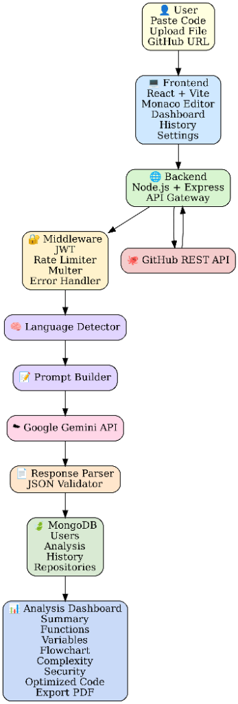
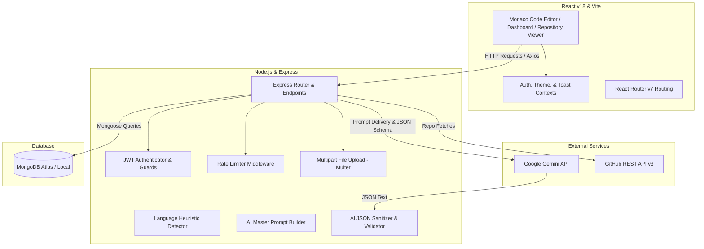

# DeCode AI — AI-Powered Code Explainer

🚀 **Live Deployed App:** [https://code-explainer-entrata-assignment-1.onrender.com/](https://code-explainer-entrata-assignment-1.onrender.com/)

DeCode AI is a full-stack, production-grade AI-powered code analysis and explanation platform. It allows developers to copy-paste code snippets, upload source code files directly, or import public and private GitHub repositories to generate multi-dimensional analyses. 

Built using a React/Vite frontend, a Node.js/Express backend, and MongoDB, DeCode AI leverages the **Google Gemini API** (using the high-speed `gemini-2.5-flash` model) to extract structured, deep code insights, security vulnerabilities, Mermaid flowcharts, time and space complexity evaluations, and side-by-side refactoring/optimization diffs.

---

## 🏗️ Architecture & System Flow



### 🌟 How It Works (Simple Breakdown)

Here is a step-by-step simple explanation of how DeCode AI processes your code from start to finish:

1. **User Request**: You paste code, drag-and-drop a file, or enter a GitHub URL in the browser.
2. **Frontend (React + Vite)**: The user interface captures your input and sends it to the backend server.
3. **Backend (Node.js + Express)**: Acts as the gateway. If you provided a GitHub link, it calls the **GitHub REST API** to pull your repository files.
4. **Middleware**: Validates your login session (JWT), prevents spam (Rate Limiter), and processes file uploads (Multer).
5. **Language Detector**: Automatically figures out if your code is Python, JavaScript, C++, Go, etc.
6. **Prompt Builder**: Formulates a detailed package containing your code and precise instructions for the AI.
7. **Google Gemini API**: Examines your code to generate explanations, complexity reports, security reviews, and optimization recommendations.
8. **Response Parser & Validator**: Cleans up the AI response to make sure it's structured correctly without any missing data.
9. **MongoDB Database**: Saves the structured analysis so you can access it in the future.
10. **Analysis Dashboard**: Renders the complete analysis with code differences (diffs), flowcharts, and a PDF download button.

---

### 💻 Technical Architecture Flow Chart



1. **User Input Phase**: The user interacts with the React frontend to submit code via the Monaco Editor, drag-and-drop file uploads, or repository URL imports.
2. **Backend Processing**: 
   - Requests hit the Express API, routing through Rate Limiting and JWT Authentication middleware.
   - For file uploads, Multer parses the multipart form data.
   - For GitHub imports, the `githubService` fetches directory structures and file contents from the GitHub API.
   - The backend runs a heuristic regex parser (`languageDetector.js`) to classify the source code language.
3. **AI Inference & Parsing**:
   - The backend constructs a highly detailed system instruction and JSON schema constraint string via `promptBuilder.js`.
   - The payload is dispatched to the Google Gemini API using `gemini-2.5-flash` with a strict `responseMimeType: "application/json"` configuration.
   - The returned response passes through `responseParser.js`, which strips potential code blocks, extracts raw JSON, and executes a shallow merge against a default schema fallback to prevent frontend crashes.
4. **Persistence & Presentation**: The structured analysis is saved to MongoDB and served back to the React UI, where interactive components render tabs, side-by-side diff editors, responsive progress bars, and reactive Mermaid control-flow diagrams.

---

## 📂 Repository Structure & Key Modules

```
ai-code-explainer/
├── backend/
│   ├── src/
│   │   ├── config/
│   │   │   └── db.js                 # MongoDB connection handler via Mongoose
│   │   ├── controllers/
│   │   │   ├── authController.js     # Standard JWT registration, login, and forgot/reset password handlers
│   │   │   ├── analysisController.js # Orchestrates code execution/analysis, file uploads, and GitHub crawls
│   │   │   ├── historyController.js  # Manages dashboard history stats and analytics retrieval
│   │   │   └── userController.js     # Manages user profile customization settings
│   │   ├── middleware/
│   │   │   ├── authMiddleware.js     # Extracts/verifies JWT tokens via Authorization header or cookies
│   │   │   ├── errorHandler.js       # Global exception handler formatting stack traces and custom errors
│   │   │   ├── rateLimiter.js        # Prevents API abuse and controls request frequencies
│   │   │   └── uploadMiddleware.js   # Configures Multer storage engine and handles file validation
│   │   ├── models/
│   │   │   ├── User.js               # User Schema (pre-saves bcrypt salt & hash, matches passwords)
│   │   │   ├── Analysis.js           # Multi-nested analysis schema housing AI summaries, functions, complex scores, and diffs
│   │   │   ├── History.js            # Tracks audit trails of analyses per user
│   │   │   └── Repository.js         # Stores reference metadata for imported GitHub repositories
│   │   ├── routes/
│   │   │   ├── authRoutes.js         # Authentication endpoints
│   │   │   ├── analysisRoutes.js     # Code upload, paste, and GitHub import routers
│   │   │   ├── historyRoutes.js      # Dashboard stats and list history routers
│   │   │   └── userRoutes.js         # Profile management routers
│   │   ├── services/
│   │   │   ├── aiService.js          # Google Gemini integration, fallback mock generator for local dev
│   │   │   └── githubService.js      # Tree-traversal crawler for repository contents and directory structures
│   │   ├── utils/
│   │   │   ├── languageDetector.js   # Fast keyword/symbol language detector
│   │   │   ├── promptBuilder.js      # Strict structured prompt system instructing Gemini
│   │   │   └── responseParser.js     # Robust JSON extractor and default field merger
│   │   └── index.js                  # Entry point setting up Express app, CORS, security, and DB connection
│   └── package.json
│
└── frontend/
    ├── src/
    │   ├── components/
    │   │   ├── layout/               # Navbar & Sidebar layout frameworks
    │   │   ├── dashboard/            # Analytical widgets and stat cards
    │   │   └── common/               # Loading skeletons, copying buttons, and alerts
    │   ├── context/
    │   │   ├── AuthContext.jsx       # Global login, register, token refresh, and loading states
    │   │   ├── ThemeContext.jsx      # Light/Dark mode state synced with local storage and CSS root classes
    │   │   └── ToastContext.jsx      # Floating, customizable status alert triggers
    │   ├── pages/
    │   │   ├── LandingPage.jsx       # Promotional application introduction and features overview
    │   │   ├── LoginPage.jsx         # Sign-in panel with error handling
    │   │   ├── RegisterPage.jsx      # Secure signup panel
    │   │   ├── Dashboard.jsx         # User stats, recent analyses list, and quick actions
    │   │   ├── AnalyzerPage.jsx      # Editor panel supporting Monaco integrations and file uploads
    │   │   ├── AnalysisResultPage.jsx# Interactive analysis layout containing tab selectors, Mermaid charts, and diff editors
    │   │   ├── HistoryPage.jsx       # Paginated dashboard displaying historical code entries
    │   │   ├── FavoritesPage.jsx     # Starred analyses filter page
    │   │   ├── RepositoryPage.jsx    # GitHub directory navigator, explorer tree, and branch visualizers
    │   │   └── SettingsPage.jsx      # Profile modification and custom credentials setting panel
    │   ├── services/
    │   │   └── api.js                # Base Axios client configurator with interceptors for JWT injection
    │   ├── utils/
    │   │   ├── languageMap.js        # Monaco mode identifier mapping
    │   │   └── exportUtils.js        # PDF/Markdown compilation utility helpers
    │   ├── App.jsx                   # React Router v7 routes configuration and layout wrappers
    │   └── main.jsx                  # Main entry point mounting React root element
```

---

## 🛠️ Key Technical Pipelines

### 1. Language Detection Engine
When a user pastes code without explicitly selecting a language, the backend runs heuristics in `languageDetector.js` to classify the script:
- **HTML/CSS/SQL**: Detects typical tag structures (`<!DOCTYPE html>`), CSS syntax elements (`body {`, `@media`), and structured query keywords (`SELECT`, `INSERT INTO`).
- **C-Family**: Distinguishes between C++ (`#include <iostream>`), C (`#include <stdio.h>`), and C# (`using System;`).
- **Modern System Languages**: Matches Go (`package main` + `func`), Rust (`fn main()` + `let mut`), Kotlin (`fun main()`), and Swift (`import UIKit` + `func`).
- **Scripts**: Discerns Python (`def` + `self.` / `elif`), PHP (`<?php`), TypeScript (`: string` / `interface`), and JavaScript as a default fallback.

### 2. Strict AI Schema Enforcement
To extract reliable, machine-readable metrics from unstructured AI output:
1. **Master Prompt Formulation**: The `promptBuilder.js` formats a strict instruction payload containing code boundaries and a detailed JSON schema.
2. **JSON Generation Config**: The generative model requests `application/json` format from Gemini.
3. **Response Sanitization**: If the model wraps responses in markdown fences (e.g. ` ```json `), `responseParser.js` slices the headers/footers, crops contents between the first `{` and last `}`, and parses the string.
4. **Defaults Merging**: To prevent runtime rendering failures (such as calling `.map()` on an undefined array or reading nested properties), the parser runs `sanitizeParsedData` which performs a shallow merge over default fallback structures for every single expected analysis field.

### 3. GitHub Explorer Traversals
The `githubService.js` uses the GitHub REST API to fetch a target repository tree structure. It supports traversing folders recursively, listing directories, and accessing files up to 5MB. Code content is extracted, and the analysis is generated and stored locally in MongoDB, linking back to the user's workspace.

---

## 📊 Database Design & Schemas

The database schema utilizes MongoDB for flexible, nested document storage.

### `User` Collection
Stores credential hashes, profiles, and federated login IDs:
```javascript
{
  name: { type: String, required: true },
  email: { type: String, required: true, unique: true },
  password: { type: String, select: false }, // Encrypted with bcrypt
  googleId: { type: String, sparse: true },
  avatar: { type: String, default: "" }
}
```

### `Analysis` Collection
The core data container keeping source code metadata and parsed analysis values:
```javascript
{
  userId: { type: ObjectId, ref: 'User' },
  code: { type: String, required: true },
  language: { type: String, required: true },
  isFavorite: { type: Boolean, default: false },
  aiResponse: {
    summary: { oneLine: String, detailed: String, beginner: String, intermediate: String, expert: String },
    executionSteps: [{ step: Number, name: String, description: String }],
    functions: [{ name: String, purpose: String, parameters: String, returnType: String, timeComplexity: String, spaceComplexity: String }],
    variables: [{ name: String, dataType: String, scope: String, initialValue: String, purpose: String }],
    codingPatterns: [String],
    designPatterns: [{ name: String, location: String, description: String }],
    flowchart: String, // Raw Mermaid Syntax
    pseudocode: String,
    algorithm: { name: String, whyUsed: String, complexity: String, realWorldApplications: String },
    bugs: [{ type: String, description: String, suggestion: String }],
    securityIssues: [{ type: String, severity: String, description: String, suggestion: String }],
    qualityScore: { score: Number, readability: Number, maintainability: Number, naming: Number, complexity: Number, documentation: Number, security: Number },
    complexity: { time: String, timeReason: String, space: String, spaceReason: String },
    optimizedCode: String,
    refactoringExplanation: { whyOptimized: String, performanceImprovements: String, readabilityImprovements: String },
    bestPractices: [String],
    codeSmells: [{ name: String, description: String }],
    performanceIssues: [{ name: String, description: String }],
    memoryEstimation: { consumption: String, dataStructuresUsed: String, optimizations: String }
  }
}
```

---

## ⚡ API Endpoints

### Authentication `/api/auth`
*   `POST /register` — Register a new user profile.
*   `POST /login` — Login and fetch JWT access token.
*   `POST /google` — Simulated Google OAuth handler.
*   `POST /forgot-password` — Requests temporary mail token.
*   `POST /reset-password/:token` — Resets credential passwords.
*   `GET /me` *(Protected)* — Fetches active user session profile details.
*   `POST /logout` *(Protected)* — Invalidates sessions.

### Code Analysis `/api/analysis`
*   `POST /explain` *(Protected)* — Processes raw pasted code and triggers Gemini analysis.
*   `POST /upload` *(Protected)* — Accepts file formats (up to 5MB) via Multer and analyzes contents.
*   `POST /github` *(Protected)* — Fetches repository tree contents and analyzes specified file trees.
*   `GET /:id` *(Protected)* — Retrieves structural analysis by document database ID.
*   `DELETE /:id` *(Protected)* — Deletes specific analysis documents from the collection.

### History & User Metrics `/api/history`
*   `GET /` *(Protected)* — Fetches historical list of analyses per user.
*   `GET /favorites` *(Protected)* — Fetches all user starred entries.
*   `POST /favorites/:analysisId` *(Protected)* — Toggles favorite status boolean.
*   `GET /repositories` *(Protected)* — Lists all parsed repositories.
*   `GET /stats` *(Protected)* — Compiles overall charts, score totals, and distributions for the dashboard.

---

## ⚙️ Getting Started & Local Setup

### Prerequisites
- **Node.js**: v18 or higher installed on your computer.
- **MongoDB**: Local Community Server instance or MongoDB Atlas cluster connection string.
- **Google Gemini API Key**: Recommended. Acquire a free/tiered key from [Google AI Studio](https://aistudio.google.com/app/apikey). If not supplied, the server falls back to simulation mode using high-fidelity mock data.

---

### Step 1: Install Dependencies
Run in both root subfolders to configure dependencies:

```bash
# Set up backend
cd backend
npm install

# Set up frontend
cd ../frontend
npm install
```

---

### Step 2: Configure Environment Files

Create `backend/.env` file:
```env
PORT=5000
MONGO_URI=mongodb://localhost:27017/code-explainer
JWT_SECRET=super_secret_jwt_hash_key_1234
JWT_EXPIRES_IN=7d
CLIENT_URL=http://localhost:5173
NODE_ENV=development

# Core Keys
GEMINI_API_KEY=your_google_gemini_api_key
GITHUB_TOKEN=your_github_developer_token

# SMTP configurations (optional)
EMAIL_HOST=smtp.gmail.com
EMAIL_PORT=587
EMAIL_USER=your_email@gmail.com
EMAIL_PASS=your_email_app_password
```

Create `frontend/.env` file:
```env
VITE_API_URL=http://localhost:5000/api
```

---

### Step 3: Run the Local Dev Servers

Start the backend API server:
```bash
cd backend
npm run dev
```

Start the frontend development server:
```bash
cd frontend
npm run dev
```

Open [http://localhost:5173](http://localhost:5173) in your browser to run the application.

---

## 🌟 Core Features List

- **Full-featured Monaco Editor**: Multi-language syntax highlighting, line numbers, and theme support matching VS Code.
- **Auto Language Identification**: Heuristic classification of standard scripts and programs.
- **Drag & Drop File Analyzer**: Direct upload support for source files.
- **Full GitHub Project Navigator**: Traverse repository contents via an interactive directory browser.
- **Structured Code Breakdown**: Four levels of targeted explanations (Beginner, Intermediate, Expert, Detailed).
- **Time/Space Complexity Math**: Clear computational cost mappings and explanations.
- **Visual Control Flow**: Dynamically generated Mermaid graphs matching program flows.
- **Interactive Side-by-side Refactoring**: Interactive code block diff viewer comparing original code against optimized output.
- **Security Audit Logs**: Clear reports identifying issues like SQL injections, CSRF, and hardcoded keys.
- **Export Formats**: Download generated analyses as Markdown documents or PDF files.
- **Personalized Dashboards**: Save favorite code explanations and review overall statistics of analyzed codebases.
